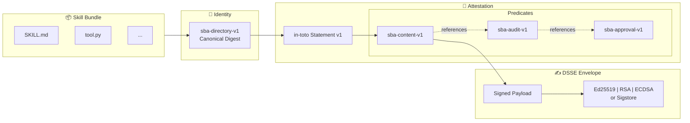

```
 ____  ____    _
/ ___|| __ )  / \
\___ \|  _ \ / _ \
 ___) | |_) / ___ \
|____/|____/_/   \_\

Skill Bundle Attestation
```

[](LICENSE)
[](https://www.python.org/downloads/)
[](tests/)

**SBA** (Skill Bundle Attestation) provides a deterministic bundle identity, content attestation format, and verification tooling for agent skill bundles. It is designed to be minimal, reproducible, and supply‑chain friendly.

## Architecture



## Key Features

| Feature | Description |
|---------|-------------|
| **Deterministic Digest** | `sba-directory-v1` algorithm produces identical hashes across platforms |
| **in-toto Compatible** | Statement v1 format integrates with existing supply chain tooling |
| **DSSE Signing** | Supports Ed25519, RSA-PSS, ECDSA, and Sigstore keyless signing |
| **Attestation Chain** | Content → Audit → Approval workflow for multi-party verification |
| **Archive Support** | Verify both directories and ZIP/tar archives |
| **Security Hardened** | Path traversal protection, symlink rejection, case-collision detection |

## Installation

```bash
pip install -e .
```

## Quick Start

```bash
# Compute bundle digest
sba digest path/to/skill

# Create content attestation
sba attest content path/to/skill --output attestation.json

# Verify attestation against bundle
sba verify attestation.json --bundle path/to/skill

# Create signed DSSE envelope
sba attest content path/to/skill \
  --envelope --sign --private-key key.pem \
  --output signed.json

# Verify signatures
sba verify signed.json --bundle path/to/skill \
  --verify-signatures --public-key key.pub
```

<details>
<summary><strong>More CLI Examples</strong></summary>

### Archive Operations
```bash
# Compute archive digest
sba digest path/to/skill.zip --archive

# Create and verify archive attestation
sba attest content path/to/skill.zip --archive --output attestation.json
sba verify attestation.json --bundle path/to/skill.zip --archive

# Archive with nested root directory
sba attest content skill.tar.gz --archive --archive-root skill-v1 --output attestation.json
sba verify attestation.json --bundle skill.tar.gz --archive --archive-root skill-v1
```

### Attestation Chains
```bash
# Verify audit attestation (references content)
sba verify audit.json --bundle path/to/skill --content-attestation content.json

# Verify approval attestation (references content + audit)
sba verify approval.json --bundle path/to/skill \
  --content-attestation content.json \
  --audit-attestation audit.json
```

### Sigstore Integration
```bash
# Verify with Sigstore bundle (keyless)
sba verify attestation.json --bundle path/to/skill \
  --sigstore-bundle bundle.json \
  --sigstore-identity you@example.com \
  --sigstore-issuer https://token.actions.githubusercontent.com
```

</details>

## Project Structure

```
sba.py              # Unified CLI entrypoint
sba_digest.py       # Canonical digest algorithm (sba-directory-v1)
sba_attest.py       # Attestation generator (Statement + DSSE)
sba_verify.py       # Verification engine + schema validation
sba_crypto.py       # Cryptographic signing/verification
sba_archive.py      # Safe archive extraction (ZIP/tar)
sba_zip.py          # Deterministic ZIP builder
sba_schemas/        # JSON schemas for all predicate types
test-vectors/       # Canonical test vectors for CI
examples/           # Example attestations and E2E demo
docs/               # Specification and threat model
RFC/                # Full RFC/whitepaper (PDF)
```

## Documentation

| Document | Description |
|----------|-------------|
| [Specification](docs/specification.md) | Protocol and algorithm details |
| [Threat Model](docs/threat-model.md) | Security analysis and mitigations |
| [RFC/Whitepaper](RFC/SBA-Specification-v1.0.0-Draft-202602.pdf) | Complete 25-page specification (PDF) |
| [E2E Demo](examples/e2e/README.md) | End-to-end signing walkthrough |
| [Testing Guide](TESTING.md) | Test setup and mutation testing |

## Standards Alignment

SBA builds on established supply chain security standards:

- **[SLSA v1.0](https://slsa.dev/)** — Supply chain Levels for Software Artifacts
- **[in-toto](https://in-toto.io/)** — Statement v1 attestation format
- **[DSSE](https://github.com/secure-systems-lab/dsse)** — Dead Simple Signing Envelope
- **[Sigstore](https://sigstore.dev/)** — Keyless signing infrastructure

## Development

```bash
# Install dev dependencies
pip install -r requirements-dev.txt

# Run all checks (lint, type check, tests, invariants)
make verify

# Generate SBOM and run vulnerability scan
make security
```

## License

[Apache-2.0](LICENSE)
